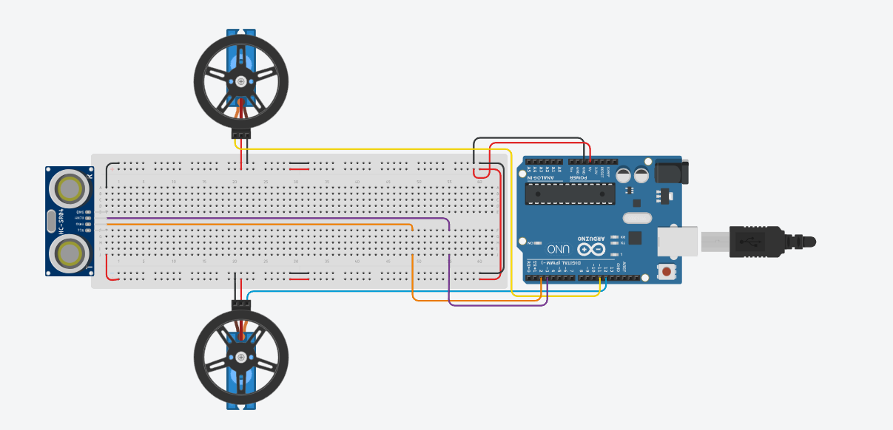

# Autonomous Robot with Ultrasonic Sensor

This project demonstrates the creation of an autonomous robot using Arduino and an ultrasonic sensor. The robot moves forward until it detects an obstacle within 20cm, upon which it executes a right turn.

## Table of Contents
- [Components Used](#components-used)
- [Circuit Diagram](#circuit-diagram)
- [Installation](#installation)
- [Usage](#usage)
- [Arduino Code Explanation](#arduino-code-explanation)
- [License](#license)
- [Credits](#credits)

## Components Used
- 1x Arduino UNO
- 2x [Continuous Rotation Servo](https://www.parallax.com/product/parallax-continuous-rotation-servo/)
- 2x [Robot Wheel](https://www.parallax.com/product/robot-wheel-molded-tire-for-servos/)
- 1x [Small Robot Chassis](https://www.parallax.com/product/small-robot-chassis/)
- 1x [2.56cm (1″) Tail Wheel Ball](https://www.parallax.com/product/1-tail-wheel-ball/)
- 1x [Small Robot Hardware Pack](https://www.parallax.com/product/small-robot-hardware-refresher-pack/)
- 1x Ultrasonic sensor (HC-SR04)
- 16x Male-to-male jumper wires
- 4x Male-to-female jumper wires
- 1x Breadboard

## Circuit Diagram

## Installation
1. **Connect the Arduino components**: Assemble the circuit as per the provided circuit diagram.
2. **Assemble the Chassis:** Assemble the chassis according to the photos in the 'Chassis without Arduino' folder using the screws.
3. **Connect the Arduino with the Chassis:** Mount the breadboard with the Arduino onto the robot's chassis.
4. **Upload Arduino Code**: Use the Arduino IDE or other suitable software to upload the provided Arduino code ('Autonomous-Robot-with-Ultrasonic-Sensor.ino') to your Arduino board.
5. **Power the Arduin**: Power the Arduino by supplying voltage using the 4-AA batteries holder.

## Usage
1. **Deploy the Robot**: Power on the robot and place it in an open area.
2. **Obstacle Detection**: The robot moves forward until it detects an obstacle within 20cm using the ultrasonic sensor.
3. **Obstacle Avoidance**: Upon detecting an obstacle, the robot executes a right turn and continues moving forward.

## Arduino Code Explanation
- **Setup Function**: Initializes the necessary pins for input and output, attaches servo motors to their respective pins, and starts serial communication.
- **Loop Function**:
  - Sends sonic signals using the ultrasonic sensor to detect obstacles.
  - Adjusts the movement of servo motors based on obstacle detection:
    - If the obstacle is further than 20cm away, both wheels move forward at maximum speed.
    - If the obstacle is within 20cm, the robot executes a right turn for one second.
  - Prints the distance to the obstacle on the serial monitor for debugging purposes.

## License
This project is licensed under the [MIT License](LICENSE).

## Credits
- **Author**: Felix-Marian STOENOIU
- **Email**: Stoenoiu.Felix1@gmail.com
- **GitHub**: [My GitHub profile](https://github.com/FelixMarian)

## Chassis Photos

## Robot Photos

